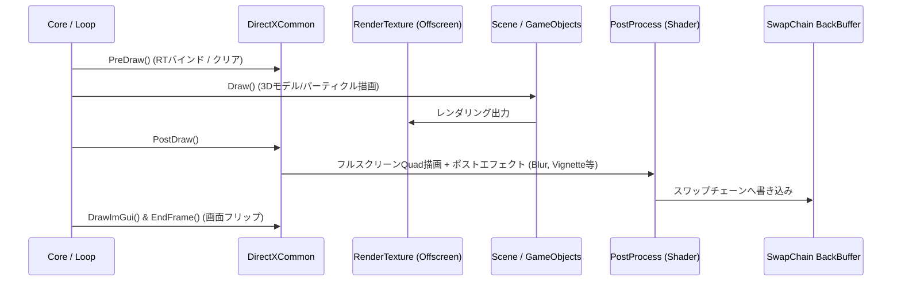
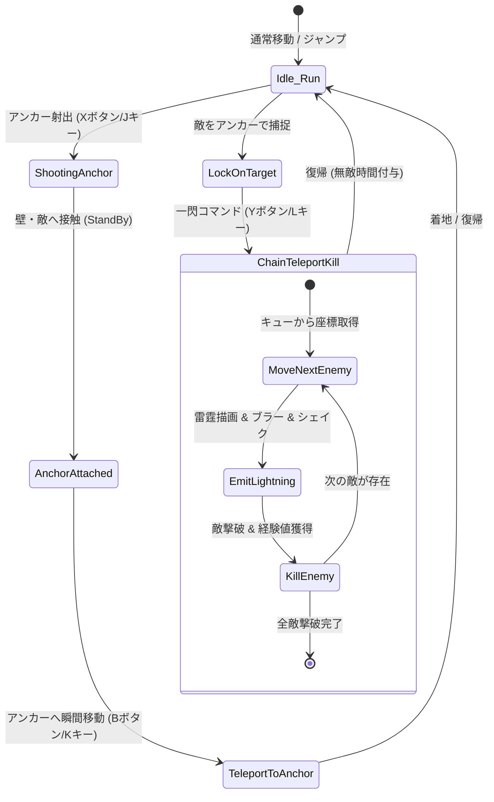

# プログラム説明資料・技術仕様書
**プロジェクト名**: BonjinEngine / 3Dワイヤー＆テレポートアクション  
**開発言語 / API**: C++20 / DirectX 12 / HLSL  
**開発環境**: Visual Studio 2022 / Windows  
**主要ライブラリ**: DirectX 12, DirectX Tool Kit (DirectXTex等), XAudio2, DirectInput, XInput, Dear ImGui  

---

## 1. 作品概要

### 1.1 ゲームコンセプト
ワイヤー状の**「アンカー」**を射出して立体的にステージを移動し、複数の敵を捕捉して一瞬で連続テレポートしながら雷撃で殲滅する**ハイスピード・チェインアクションゲーム**です。

```
[アンカー発射] ──> [地形へテレポート移動] または [複数敵をロックオン] ──> [一閃連鎖撃破（Lightning Chain）]
```

### 1.2 コアゲームプレイ
- **アンカー射出＆地形テレポート**: 狙った方向へアンカーを放ち、壁や足場に到達したアンカー位置へ瞬時にテレポート。
- **マルチロックオン＆連鎖雷撃**: アンカーで複数の敵を捕捉（ロックオン）し、コマンド一発で敵から敵へと瞬時に連続テレポートしながら雷霆エフェクトと共に一撃粉砕。
- **爽快感を極限まで高める演出群**:
  - 動的生成される稲妻メッシュ（`Lightning3D`）
  - テレポート瞬間のラジアルブラー（Radial Blur）
  - ヒットストップ（時間停止）＆ カメラシェイク（画面振動）
  - 被ダメージ時のヴィネット（画面端赤色フラッシュ）

---

## 2. 全体アーキテクチャ

本プロジェクトは、低レイヤの描画・基盤を担う**「Engine層（BonjinEngine）」**と、ゲームロジック・シーン進行を担う**「Application層」**が明確に疎結合設計されています。

```mermaid
graph TD
    subgraph "Application Layer"
        Core["Core (Main Loop)"] --> SceneManager["SceneManager"]
        SceneManager --> TitleScene["TitleScene"]
        SceneManager --> TutorialScene["TutorialScene"]
        SceneManager --> GameScene["GameScene"]
        SceneManager --> ResultScene["ResultScene"]
        
        TutorialScene --> BattleController["BattleController"]
        GameScene --> BattleController
        
        BattleController --> Player["Player"]
        BattleController --> BaseEnemy["BaseEnemy / NoGravityEnemy"]
        BattleController --> MapChipField["MapChipField"]
        BattleController --> CameraController["CameraController"]
        
        Player --> Anchor["Anchor"]
        Player --> PlayerStatus["PlayerStatusComponent"]
    end

    subgraph "Engine Layer (BonjinEngine)"
        DirectXCommon["DirectXCommon (DX12 / PostProcess)"]
        PSOManager["PSOManager (RootSignature & PipelineState)"]
        Object3D["Object3D / ModelManager"]
        Line["Line2D / Line3D / Lightning3D"]
        ParticleManager["ParticleManager"]
        Input["Input (DirectInput) / Gamepad (XInput)"]
        AudioPlayer["AudioPlayer (XAudio2)"]
        ImGuiManager["ImGuiManager"]
    end

    Application Layer --> Engine Layer
```

---

## 3. 自作ゲームエンジン（BonjinEngine）の技術仕様

DirectX 12をゼロからラップし、高効率な描画パイプラインとポストプロセス環境を構築しています。

### 3.1 レンダリングパイプライン & ポストプロセス
- **マルチパス・レンダーターゲット構成**:
  - `RenderTexture` を用いたオフスクリーンレンダリングを採用。
  - シーン全体の描画結果に対して、後処理として多段ポストエフェクトを適用可能。
- **実装されているポストエフェクト**:
  1. **Radial Blur（放射ブラー）**: テレポート時の疾走感・速度感を強調。
  2. **Vignette（ヴィネット）**: 画面四隅を暗転/赤色化（被ダメージ演出として滑らかなイージング減衰）。
  3. **Luminance / Depth Outline**: 輝度および深度バッファを活用した輪郭線抽出。
  4. **Gaussian / Box Filter**: 高品質なブラー効果。
  5. **Dissolve（ディゾルブ）**: ノイズテクスチャを用いた消滅・出現演出。
  6. **HSV Filter / Grayscale / Random Noise**: カラーグレーディング・ノイズ。



### 3.2 パイプラインステート管理（`PSOManager`）
- ルートシグネチャ（RootSignature）とパイプラインステートオブジェクト（PSO）を一元管理。
- 不透明オブジェクト、半透明ブレンド、加算合成（パーティクル用）、ライン描画、ポストプロセス各種専用シェーダーを状態ごとに事前生成してキャッシュ。

### 3.3 動的エフェクト生成システム
- **`Lightning3D`**:
  - 始点と終点の間をランダムかつフラクタル状に分割し、ジグザグな稲妻の頂点データを動的に構築して3D空間に描画。
- **`ParticleManager`**:
  - ラムダ式による更新関数（`updateFunc`）を登録可能な汎用エミッター。
  - 着弾時の放射スパーク（`anchorHitRay`）やフラッシュ（`anchorHitFlash`）、着地土煙（`landingDust`）などを柔軟に制御。

### 3.4 リソースリーク検出
- `D3DResourceLeakChecker` により、DXGIデバッグレイヤ経由で終了時に未解放のCOMオブジェクト（DirectX12リソース）をコンソールへ完全ダンプ。メモリリークを未然に防止。

---

## 4. ゲームシステム & ロジック設計

### 4.1 ゲーム進行構造（`BaseScene` & `BattleController`）
- **シーン基底クラス（`BaseScene<TPhase>`）**:
  - テンプレートを用いたフェーズ管理（`kStart`, `kPlay`, `kGoal` 等）を各シーンに提供。
- **バトルロジックの共通化（`BattleController`）**:
  - `GameScene` と `TutorialScene` の双方が `BattleController` を所有。
  - プレイヤー生成、敵のスポーン・リスポーン管理、マップチップ生成、ヒットストップ、衝突判定処理の重複を排除。

```
[TutorialScene] ──(所有)──┐
                          ├──> [BattleController] ──> [Player / Enemies / MapChip]
[GameScene]     ──(所有)──┘
```

### 4.2 プレイヤークラス（`Player`）
- **状態管理 & 物理**:
  - 重力加速度、空中制御、最大速度クランプ、左右旋回補間（`turnTimer_`）、ノックバック減衰。
- **アンカー制御（`shootAnchor`）**:
  - アナログスティックまたはWASD入力の角度（上下45度 / 水平）を計算し、初速ベクトルを与えてアンカー（`Anchor`）を射出。
  - プレイヤーとアンカーの間に `Line3D` をリアルタイム描画。
- **テレポート連鎖撃破（`RemoveLockedOnEnemies`）**:
  1. ロックオンされた敵の座標リストをキュー（`teleportQueue_`）へ登録。
  2. キューから順次座標を取り出し、プレイヤーを高速瞬間移動。
  3. テレポート元とテレポート先の間に `Lightning3D`（雷撃）を発生させ、ラジアルブラー・カメラシェイク・ヒットストップを発動。
  4. 対象の敵を撃破状態（Exp獲得）にする。



### 4.3 敵AIシステム（`BaseEnemy` / `Enemy` / `NoGravityEnemy`）
- **`BaseEnemy`（基底クラス）**:
  - 共通インターフェース（HP、経験値報酬、ロックオン状態、死亡フラグ、アニメーションタイマー等）。
- **`Enemy`**:
  - 地上巡回型。マップ衝突判定と重力を持ち、壁や崖で反転移動。
- **`NoGravityEnemy`**:
  - 空中浮遊型。重力の影響を受けず、プレイヤーとの距離・角度を監視して追従＆弾丸（`EnemyBullet`）を発射。

### 4.4 マップチップ & 衝突判定システム（`MapChipField` / `GameObject`）
- **マップデータ読み込み**: CSVファイルからブロック配置、プレイヤー初期位置、ゴール位置、エネミー配置を自動パース。
- **精密なAABB & 角判定（Corner Detection）**:
  - プレイヤーやアンカーの4隅（LeftTop, RightTop, LeftBottom, RightBottom）のマップチップ座標をリアルタイム計算。
  - 地形への埋まり込み防止（押し戻し補正）を完備。
- **ビットフラグによるコリジョンフィルタリング**:
  - `kAttributePlayer`, `kAttributeEnemy`, `kAttributeGoal`, `kAttributeEnemyBullet` などのカテゴリとマスクによる衝突判定。

### 4.5 ステータス & 成長システム（`PlayerStatusComponent`）
- レベル、現在HP、最大HP、攻撃力、経験値をカプセル化。
- 敵撃破時に経験値を獲得し、一定値到達でレベルアップ・ステータス上昇。

---

## 5. こだわりの技術・演出ハイライト

| 演出・システム | 実装技術 | 効果・狙い |
| :--- | :--- | :--- |
| **連鎖雷撃 (Lightning Chain)** | `Lightning3D` + 動的メッシュ生成 | 敵から敵への軌跡を稲妻として可視化し、一閃の爽快感を演出 |
| **テレポートブラー** | `RenderTexture` + Radial Blur シェーダー | 瞬間移動時の圧倒的なスピード感・加速感を表現 |
| **ヒットストップ & シェイク** | `BattleController`（時間停止）+ `Camera`（乱数振動） | 攻撃命中時の手応え・重厚感をプレイヤーへフィードバック |
| **被ダメージヴィネット** | Vignette シェーダー + EaseOutQuad 補間 | 画面端の赤色フラッシュにより、直感的な危機状況の認知を向上 |
| **リアルタイムデバッグ** | Dear ImGui + パラメータツリー | プレイヤー挙動、エフェクト時間、ポストプロセス強度を実行中に微調整可能 |

---

## 6. クラス構成一覧

```
project/
├── main.cpp                  # エントリーポイント (WinMain, リークチェッカー起動)
├── application/              # ゲーム固有ロジック
│   ├── core/
│   │   └── Core.h / .cpp     # ゲームループ, シーン初期化
│   └── scene/
│       ├── interface/
│       │   └── BaseScene.h   # シーン基底テンプレート
│       ├── title/            # タイトル画面
│       ├── tutorial/         # チュートリアル画面
│       ├── game/             # 本編ゲームプレイ
│       │   ├── BattleController.h / .cpp   # 戦闘進行・スポーン・判定
│       │   ├── GameScene.h / .cpp
│       │   ├── gameObject/
│       │   │   ├── GameObject.h / .cpp      # オブジェクト基底 (AABB/物理)
│       │   │   ├── player/                  # プレイヤー, ステータス
│       │   │   ├── enemy/                   # エネミー基底, 地上/空中敵, 弾
│       │   │   ├── anchor/                  # アンカー
│       │   │   └── camera/                  # カメラ追従・シェイク
│       │   ├── mapchip/                     # マップチップ, CSVローダー
│       │   └── logic/                       # データ定義
│       └── result/           # リザルト画面
│
└── engine/                   # 自作ゲームエンジン「BonjinEngine」
    ├── core/
    │   ├── bonjin/           # エンジン統括 (Initialize / PreDraw / PostDraw)
    │   └── common/           # DirectXCommon (DX12低レイヤ, ポストプロセス)
    ├── graphics/
    │   ├── 3d/               # Object3D, Line3D, Lightning3D, SkyBox, Camera
    │   ├── 2d/               # Sprite, Line2D
    │   └── core/pso/         # PSOManager (PSO / RootSignature)
    ├── system/
    │   └── manager/          # Texture, Model, Particle, Light, ImGui, Scene
    ├── audio/                # AudioPlayer (XAudio2)
    └── interface/            # Collider, 各種インターフェース
```

---

## 7. 操作方法一覧

| 操作 | キーボード / マウス | ゲームパッド (XInput) | 挙動 |
| :--- | :--- | :--- | :--- |
| **左右移動** | `A` / `D` | 左スティック 左右 | 左右移動（空中制御対応） |
| **ジャンプ** | `SPACE` | `A` ボタン | ジャンプ |
| **アンカー発射** | `J` (+ `W`/`S` で角度調整) | `X` ボタン (+ 左スティック上下) | 向いている方向（水平/斜め）へアンカー射出 |
| **テレポート移動** | `K` | `B` ボタン | 設置されたアンカー位置へ瞬間移動 |
| **連鎖雷撃 (撃破)** | `L` | `Y` ボタン | ロックオン中の敵を一掃する連続テレポート雷撃 |
